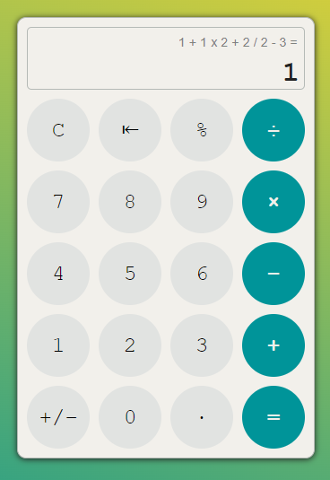

# Desafio - Calculadora

A proposta era construir uma calculadora que registrasse o histórico do cálculo, 
que fizesse operações diferentes em uma única linha, respeitando a ordem matemática, preferencialmente sem usar o método *eval*

alterações necessárias:
precisa ter a tag form
ser responsiva

alterações futuras:
- acessibilidade
- tela horizontal

Essa é a aparência da calculadora.

