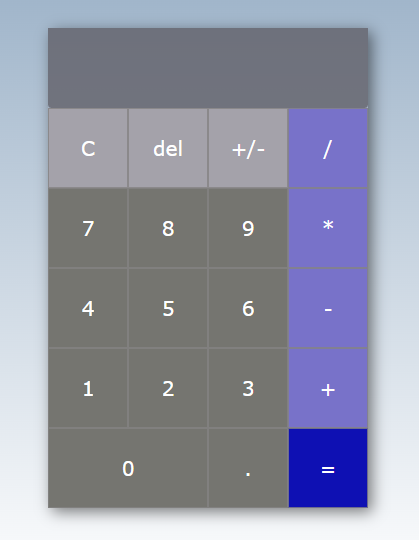

# Desafio - Calculadora

## Resolução

A calculadora foi construida utilizando **HTML** simples, **CSS** com [***grid***](https://developer.mozilla.org/pt-BR/docs/Web/CSS/CSS_Grid_Layout/Basic_Concepts_of_Grid_Layout) para melhor alinhamento do elementos na estilização e funções em **JavaScript**.

Ela permite o cálculo de operações diferentes na mesma linha, por exemplo, uma soma e uma multiplicação na mesma expressão, mas é importante ressaltar que a função utilizada para este cálculo respeita a precedência aritmética dos operadores. Isso significa que na expressão citada como exemplo a multiplicação é realizada antes da adição, portanto, deve-se prestar atenção na construção das expressões a depender do resultado desejado. 

Esta é uma calculadora simples que não usa, até o momento, separação por parenteses, por exemplo, logo as operações de divisão e multiplicação serão sempre realizadas antes das operações de soma e subtração.

É importante também sempre lembrar de usar a função **clear** (botão 'C') antes de iniciar um novo cálculo para limpar o display e não gerar erros matemáticos com números sobrando na expressão.

### **HTML**
- Uma **'div'** com a classe ***container*** contendo uma **'section'**, onde foi aplicado o grid, e nesta todas os botões da calculadora;
- **10 botões numéricos** (de 0 a 9);
- **8 botões com operadores e funções**;
- Cada botão tem definida uma **classe** para ser utilizada na estilização;
- Um **input** com a classe ***display*** onde são exibidos os dígitos acionados na calculadora.

Os itens foram ***'classificados'*** com nomes diferentes para facilitar futuras modificações no código.

### **CSS**
O documento ***CSS*** possui uma formatação genérica determinando ***margin***, ***padding***, ***font-family*** e ***box-sizing*** para todos os elementos. Em seguida apresenta a formatação de estilo para as classes.

Na classe **'container'** é definido o tamanho, a cor de fundo e o alinhamento. 

Na classe **'display'** é definida a cor de fundo, o estilo da borda, o tamanho e cor da fonte, a opacidade e a extensão do grid para esta parte.

A classe **'zero'**, que contem o botão zero, tem seu grid diferente dos demais botões, ocupando 2 colunas.

Na **'section'** é aplicado o grid para fazer as divisões de todos os botões seguindo alinhamento linha-coluna. O grid neste projeto foi dividido em **6 linhas e 4 colunas**.

A classe **'item'** tem 3 estilizações separadas, a 1ª delas genérica determinando o tamanho e a cor da fonte, a transição do mouse e a borda. Já a 2ª determina a transição do **'hover'** que modifica a opacidade do botão quando o mouse passa por cima dele, e a 3ª estiliza a transição do **'active'**, que sinaliza mudando a cor do botão quando ele é clicado.

Por último a estilização dos botões que foram divididos em classes diferentes, sendo:

- ***'button-operations-right'*** para os botões posicionados à direita, que contêm os operadores matemáticos;
- ***'button-numbers'*** para números;
- ***'button-operations'*** para outros operadores;
- ***'button-calculate'*** para o botão de igual, que contém a função que realiza o cálculo.

### **JavaScript**

Todas os botões da calculadora recebem funções por meio do evento ***onclick***, ou seja, as funções são acionadas quando o botão é clicado.
Os números e os operadores digitados são strings, e para esse tipo de dado o JavaScript tem alguns métodos nativos, alguns deles serão descritos adiante.

O documento JS contém 5 functions, descritas a seguir:

- **'function insertValues'** é a função responsável por capturar e guardar os valores e operadores digitados, de acordo com os botões acionados na calculadora. Esses valores e operadores aparecem no display e são calculados no momento que é acionado o botão **'='**. Para possibilitar que seja registrada uma sequência de valores, esta função tem uma variável que recebe ela mesma e concatena com o parâmetro **num**, ou seja, a cada vez que é digitado um valor, ele é acrescentado na sequência dos valores que já estavam no input.
```
function insertValues(num) {
  const input = document.getElementById('input-value').value;
  document.getElementById('input-value').value = input + num;
}
```

- **'function calculate** é a função que realiza os cálculos matemáticos quando o botão de igual (=) é acionado. O display recebe uma expressão string como input e através da função **'eval'** avalia essa expressão, realiza o cálculo e retorna seu valor. Essa função deve ser usada com cuidado, para mais informações acesse este [site](https://developer.mozilla.org/pt-BR/docs/Web/JavaScript/Reference/Global_Objects/eval).
```
function calculate() {
  const input = document.getElementById('input-value').value;
  document.getElementById('input-value').value = eval(input);
}
```

- **'function clearInput'** é acionada quando clicado o botão **'C'**, ela limpa o conteúdo do input atribuindo a ele uma string vazia.
```
function clearInput() {
  document.getElementById('input-value').value = "";
}
```

- **'function invert'** inverte o sinal do valor, é chamada quando acionado o botão **'+/-'**. Para evitar erros, dentro desta função é chamada a função para calcular antes de fazer a inversão do sinal, ou seja, primeiro é feito o cálculo pela ***'function calculate'***, em seguida o valor é **multiplicado por -1**, assim se o valor era positivo fica negativo ((+) + (-) = (-)) e se era negativo fica positivo ((+) + (+) = (+)).
```
function invert() {
  calculate()

  const input = document.getElementById('input-value').value;
  document.getElementById('input-value').value = input * -1;
}
```

- **'function back'** apaga o último dígito (à direita) quando acionado o botão **'del'**. Para isso é usado o método [***substring***](https://developer.mozilla.org/pt-BR/docs/Web/JavaScript/Reference/Global_Objects/String/substring) que cria uma string a partir de outra string, pega apenas um pedaço da string original. O valor contido no display é alocado em uma variável, essa recebe uma substring do próprio valor delimitada pelo índice **0** como limite inicial e como limite final, o **tamanho da string -1**. Assim, o último dígito é apagado a cada vez que o botão ***'del'***é clicado.
```
function back() {
  const input = document.getElementById('input-value').value;
  document.getElementById('input-value').value = input.substring(0, input.length - 1);
}
```
Essa é a aparência da calculadora.


